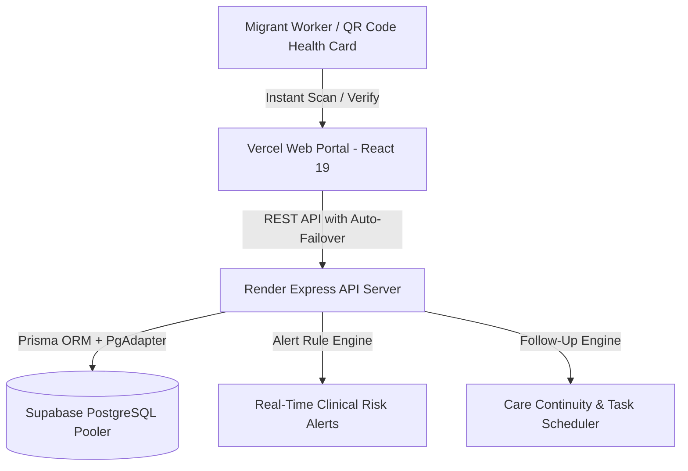

# Technical Solution: Kerala Migrant Health Record Portal (SIH25083)

**Production Web App:** [https://sih25083-health-record.vercel.app](https://sih25083-health-record.vercel.app)  
**Backend API Server:** [https://sih25083-health-record.onrender.com](https://sih25083-health-record.onrender.com)  
**Database:** Supabase Cloud PostgreSQL (Transaction Pooler - Port 6543)  
**Architecture:** Distributed Full-Stack Cloud Architecture (SPA + REST API + Relational DB)

---

## 1. Solution Overview
The **Kerala Migrant Health Portal** is an end-to-end digital health record platform specifically engineered to bridge the healthcare divide for interstate migrant workers in Kerala. The solution establishes a continuous, secure, and accessible health record ecosystem that moves with the worker across districts, medical camps, and hospitals.

---

## 2. Key Architecture & Technical Modules

### A. Portable Digital Health ID & Verification Module
- **Standardized Identification:** Generates unique, tamper-proof Portable Health IDs (e.g. `KMH-2026-00001`) with QR generation support.
- **Fast Lookup & Verification:** Health workers can instantly scan or input a worker's ID at mobile medical camps or hospital triage desks to pull complete longitudinal clinical records in milliseconds.

### B. Intelligent Automated Health Risk Alert Engine
- Evaluates clinical consultation data on-the-fly and generates severity-tagged alerts:
  - **High-Risk Alerts (🔴):** Severe hypertension ($BP \ge 140/90$), high fevers ($\ge 102^\circ\text{F}$ with acute febrile symptoms/dengue screening), severe penicillin/sulfa allergies.
  - **Medium-Risk Alerts (⚠️):** Occupational dermatitis, chronic respiratory bronchitis, diabetes follow-ups.
- Alerts are dynamically computed and visible directly on patient stat badges and worker cards across the portal.

### C. Clinical Encounters & Prescription Management
- **Structured Consultations:** Captures chief complaints, clinical diagnosis (ICD-10 aligned), patient vitals ($BP$, Temperature, Pulse, Weight), and doctor clinical notes.
- **Prescription (Rx) Tracker:** Records medicine name, dosage, frequency, and duration to prevent adverse drug interactions across different medical facilities.

### D. Automated Follow-Up & Adherence Tracking System
- Automatically detects patients requiring follow-up examinations (e.g. skin rash evaluations, antibiotic course reviews, febrile monitoring).
- Calculates real-time status: `PENDING`, `DUE SOON`, `OVERDUE`, and `COMPLETED` with one-click completion logging.

### E. Analytics & District Epidemiological Dashboard
- High-level KPIs: Total registered workers, completed clinical encounters, healthcare facility distribution, and active medical staff.
- State-of-origin migration distribution analytics and recent encounter feeds.

---

## 3. Technology Stack & Deployment Infrastructure

| Layer | Technology | Key Capabilities |
| :--- | :--- | :--- |
| **Frontend UI** | **React 19 + TypeScript + Vite + Tailwind CSS** | Ultra-responsive 3-column / 2-column paired layout with CSS scroll-snapping and zero card cutoff |
| **Frontend Hosting** | **Vercel Global Edge Network** | Global CDN distribution with SPA rewrite configurations (`vercel.json`) |
| **Backend API** | **Node.js + Express + TypeScript** | Modular REST API with structured route controllers and centralized error handling |
| **Backend Hosting** | **Render Cloud Web Service** | 24/7 continuous cloud server with health monitoring (`/api/health`) |
| **Database & ORM** | **Prisma ORM + Supabase PostgreSQL** | High-availability PostgreSQL accessed via Supabase Session/Transaction Pooler (Port 6543) |
| **Security & Utilities** | **CORS, Dotenv, QR Generator, Alert Engines** | Robust SSL connection pooling, parameter validation, and secure cross-origin communication |

---

## 4. Impact & Real-World Benefits

1. **Zero Medical History Loss:** A worker moving from a plywood factory in Perumbavoor to a construction site in Kozhikode has their complete health records instantly accessible by any attending doctor.
2. **Language Barrier Reduction:** Standardized clinical categorization, diagnostic tags, and preferred language profiles allow medical staff to communicate effectively.
3. **Outbreak Prevention:** Real-time logging of waterborne illnesses and occupational skin/respiratory conditions allows the Health Department to initiate early interventions at migrant camps.
4. **Paperless & Cost-Effective:** Replaces cumbersome paper slips with an agile, cloud-native platform that costs zero overhead for guest workers.
